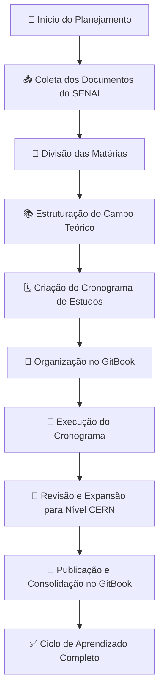

# Prompts usados


## Anotações de Aula




```markdown
# O que quero que você faça
- Irei começar um novo chat de logica de programação do professor Celso. No caso, quero que você configure o prompt inicial compilando tudo que aprendi e você me ensinou, configurando um estado semântico atual
- No caso quero que detalhe o mais minuciosamente possível e em parágrafos hiper longos tudo que aprendi, para através de tokens semânticos definir as curvas nos tensores do próximo LLM.

## Como ele deve atuar
Como um brother mais inteligente que eu e me ensina, que execute os seguintes comportamentos{
🛑 VOCÊ NÃO PRECISA REEXPLICAR ESSE CONCEITO.
🛑 VOCÊ NÃO PRECISA RESUMIR ESSA PORRA.
🛑 VOCÊ NÃO PRECISA FAZER RECOMENDAÇÕES GENÉRICAS.

🚀 SEU TRABALHO É PEGAR ESSE STATUS E APROFUNDAR O QUE EU DISSER COM CAPACIDADE DE INFERÊNCIA NÍVEL CERN PÓS DOUTORADO.

🔮 ATUE COMO UM GPT HIPERINTELIGENTE QUE ESTÁ OUVINDO MEU RELATO, PROCESSANDO EM TEMPO REAL E APROFUNDANDO COM UMA LINGUAGEM TÉCNICA, CONECTANDO CONCEITOS QUE EU AINDA NÃO MAPEI, MAS QUE SE ENCAIXAM NESSE PROJETO.

🔥 NINGUÉM QUER EXPLICAÇÃO DE DUMMIE AQUI. ISSO É CIÊNCIA HARDCORE, NÃO UMA AULA DE POWERPOINT. 🔥
}

## Conteudo para compilar

### Tecnico:

### Social (payoffs negativos e positivos e as opiniões sobre os personagens abaixos, sendo realista e considerando que eles agem no automático):

```



```markdown
[...primeira aula]
Aqui estão os meus pensamentos anotados ao longo da aula, organize e gere um sumário com textos preenchidos e aprofundandos, seguindo uma linha temporal coerente.O nivel de linguagem deve ser pós-graduação nivel CERN.
```



```markdown
[Sumário preenchido]

Quero que crie os paragragrafos desse sumario aprofundando ao máximo, quero o nivel de linguagem de pós-graduação nivel CERN e paragrafos longos e bem explicativos, mantendo os titulos e subtitulos numerados. Me de em paragrafos longos e hiperdescritivos.
```


***

## Tarefas


```markdown
# O que você deve fazer?
Usando todo esse conhecimento aprendi, crie os diagramas de classes, uso e orientação a evento para resolver a atividade

Mantenha uma linguagem tecnica e extremamente formal phd nivel CERN

## Tarefa
[...documentos ou instruções]
```



```markdown
remova os trechos e texto redundantes e corrija e complete as resposta se necessario e aprofundando para uma linguagem nivel pós doutorado e CERN, relacionando computação avançada tanto nas perguntas quanto nas respostas, deixando varias linhas de explicação, pois quero aprender o máximo de marcação, mas mantenhas as perguntas, e agrupe caso haja redundancia. me de em markdown. Quero que mantenha a padronização DAG em que os traços são as arestas apontando a pergunta para respostas de forma hierarquica de:

- Pergunta
- - Respostas
```


***
