# Arquitetura de um Plano de Estudos Nível CERN para o SENAI

***

### **📌 Meu Caderno de Estudos**

Bom, dado que nunca consegui me adaptar aos metódos tradicionais de ensino, decidi me aprofundar no meu próprio nivel seguindo uma escala logaritma e retroalimentativa(Através da saturação de teoria) ao invés do método supervisionado, e esse caderno é a compilação disso.

O processo segue a ideia de que **não basta aprender, é preciso absorver o conceito na estrutura neural de forma modular e escalável**, a ponto de transformar conhecimento bruto em **arquitetura de sistemas mentais interligados**, fazendo com que **o que é aprendido em um campo se reflita e otimize outro**.

Aqui, **não existe aprendizagem isolada**. Tudo é conectado, tudo é interdependente, onde amarro conceitos complexos e aparentemente desconexos.

**O objetivo é deixar o sistema nervoso tão saturado de informação relevante que ele comece a processar padrões automaticamente, como um modelo bayesiano de inferência cognitiva rodando 24/7.**

***

### **⚙️ Estrutura do Plano: Escala e Profundidade**

Dado que **cada matéria aparece apenas uma vez por semana**, a única forma de alcançar um nível de entendimento próximo ao **CERN/pós-doutorado** ~~com os recursos de um fodido~~ é garantir que o tempo de exposição ao conteúdo seja maximizado **por inferência indireta**.

Ou seja:\
✔ **Não basta estudar um tópico, ele tem que ser desmembrado, correlacionado com outros conceitos e armazenado como heurística funcional.**\
✔ **Cada aula não é um ponto isolado, mas um nó dentro de um grafo de aprendizado interconectado.**\
✔ **A curva de aprendizagem não pode ser linear, mas logarítmica — expandindo-se com base na retroalimentação das próprias descobertas.**

Isso significa que **a estrutura tradicional de ensino é insuficiente**.\
O modelo que funciona aqui é o de **saturação absoluta do campo teórico**, documentado de forma organizada para garantir **facilidade de indexação e recuperação do conhecimento através da interação com LLM's**

***

### **🧠 Modo Operacional: Fragmentação, Síntese e Refinamento**

O aprendizado é quebrado em **três fases essenciais**, cada uma atuando como um mecanismo independente **capaz de gerar um ciclo de feedback positivo contínuo**.

1️⃣ **Fragmentação** (Coleta e Destruição)

* Cria-se um cronograma de estudas baseado no conteúdo de um semestre, através de um chatbot e relacionado a matéria principal.
* Separa **termos-chave, modelos matemáticos, fundamentos científicos e arquitetura estrutural**.
* **Filtra a informação irrelevante e expande os pontos críticos** com fontes mais avançadas.

2️⃣ **Síntese** (Construção de uma Máquina Cognitiva)

* **Reconstrói o conhecimento** de forma hierárquica, alinhada a um modelo de progressão lógica.
* **Documenta tudo** no GitBook em formato de teoria, **com exemplos que extrapolam os limites do conteúdo didático original**.
* Organiza os conceitos como **um sistema de indexação mental** — um **banco de dados neural** que permite acesso rápido e transversal ao que foi aprendido.

3️⃣ **Refinamento** (Nível CERN)

* **Expande cada conceito ao nível mais profundo possível através de uma linguagem avançada produzida por um chatbot.**
* **Elimina qualquer incerteza cognitiva** por meio de validação de embeddings integrados na minha própria rede neural.
* **Corrige inconsistências lógicas e refatora o entendimento** baseado em novos insights e descobertas subsequentes.

Esse processo **nunca é linear**, ele **é iterativo e retroalimentado**, garantindo que cada novo aprendizado seja **conectado e aprimorado dentro do sistema existente**.

***

### **📖 GitBook: O Repositório Cognitivo**

Todo esse conhecimento não pode ser apenas absorvida, **ele precisa ser armazenado de forma funcional**, permitindo: 

✔ **Recuperação rápida e eficiente**\
✔ **Interconectividade entre os tópicos**\
✔ **Aprimoramento contínuo baseado na nova camada de inferência gerada a cada iteração**

Por isso, o **GitBook se torna o centro de documentação**, onde cada tema é tratado como **uma entidade modular**, podendo ser acessado, refinado e expandido de forma autônoma.

A estrutura básica de cada entrada no GitBook segue um **padrão de indexação avançado**, onde cada conceito é ligado a outros através de **modelagem semântica baseada em inferência contextual**.

**Isso transforma o aprendizado em um sistema neural vivo, que cresce e evolui de forma dinâmica.**

***

### **🔄 Fluxograma do Processo**

Aqui está a estrutura visual da minha meta de estudos:

```mermaid
graph TD;
    Inicio["🎯 Início do Planejamento"] --> ColetaDocs["📥 Coleta dos Documentos do SENAI"];
    ColetaDocs --> DivisaoMaterias["📂 Divisão das Matérias e Criação do Cronograma"];
    DivisaoMaterias --> Fragmentacao["🧩 Fragmentação (Coleta e Destruição)"];
    Fragmentacao --> Sintese["🧠 Síntese (Construção de uma Máquina Cognitiva)"];
    Sintese --> Refinamento["🔬 Refinamento (Nível CERN)"];
    
    Refinamento --> OrganizacaoGitBook["📑 Organização e Indexação no GitBook"];
    OrganizacaoGitBook --> ExecucaoEstudos["🚀 Execução e Teste do Modelo"];
    ExecucaoEstudos --> RevisaoCiclo["♻️ Revisão Iterativa e Otimização"];

    RevisaoCiclo --> Publicacao["📝 Publicação e Consolidação do Conhecimento"];
    Publicacao --> Fim["✅ Ciclo de Aprendizado Completo (Retroalimentação)"];

    %% Conexões adicionais para mostrar ciclos de retroalimentação
    RevisaoCiclo -->|Ajuste do Sistema| Fragmentacao;
    Refinamento -->|Expansão Baseada em Novas Descobertas| Sintese;
    ExecucaoEstudos -->|Testes Práticos e Validação| RevisaoCiclo;

```



Cada etapa não é apenas um ponto no tempo, mas **um estado de aprendizado em constante evolução**.

***

### **🛠️ O Modelo de Aprendizagem Não Convencional**

#### **📌 O que diferencia essa abordagem?**

1. **Não existe aprendizado isolado.** Cada novo conceito precisa **conectar-se a outro**, garantindo **expansão progressiva da rede de conhecimento**.
2. **Cada matéria do SENAI é apenas um ponto de partida.** O real objetivo é **transcender o conteúdo didático e ampliar o escopo até o limite técnico da área**.
3. **O aprendizado se dá em ciclos iterativos.** Cada passagem pelo conteúdo não é uma repetição, mas **um refinamento da modelagem cognitiva**.
4. **A informação é armazenada e indexada de forma funcional.** O **GitBook serve como um repositório ativo**, onde atuo mais como um eremita, colapsando pensamentos em binarios.

***

### **💡 No fim de tudo...**

Esse metodo é **engenharia do aprendizado**, um framework onde **foco em absorver, processar e expandir informação no nível máximo de eficiência**.

O SENAI pode até definir a grade horária, mas o controle absoluto sobre a **forma como o aprendizado é absorvido, modelado e processado** é meu.\
Esse método **não só supera a abordagem tradicional, ele a destrói e reconstrói em um nível que a maioria dos alunos jamais conseguirá alcançar.**

Se alguém quiser aprender o básico, que siga o cronograma padrão.\
Se o objetivo for **dominar a porra toda**, **então esse é o caminho.** 🚀

***

## Cronograma:

### **📅 Mês 1-2: Fundamentos Estruturais e Segurança**

🔹 **Semana 1:** Introdução à Segurança da Informação: Princípios e Modelos de Ameaças\
🔹 **Semana 2:** Métodos de Ataque e Defesa: Do Phishing ao Kernel Exploit\
🔹 **Semana 3:** Engenharia Social: Como o Cérebro Humano é a Maior Vulnerabilidade\
🔹 **Semana 4:** Uso de Hardware para Segurança: TPM, Secure Boot e Virtualização\
🔹 **Semana 5:** Uso de Software para Hardening: SELinux, AppArmor, Windows Defender Internals\
🔹 **Semana 6:** LLMs e IDS: Como Modelos de IA Podem Prever e Mitigar Ataques\
🔹 **Semana 7:** Inteligência Artificial Aplicada à Segurança: Modelos Generativos para Anomalias\
🔹 **Semana 8:** Engenharia Reversa com IA: Automação de Análises de Binários

***

### **📅 Mês 3-4: Sistemas de Arquivos e Estruturas de Dados**

🔹 **Semana 9:** Sistemas de Arquivos: FAT32, NTFS, EXT4, Btrfs, ZFS\
🔹 **Semana 10:** Alocação de Espaço: Fragmentação, Tabelas de Alocação, Desfragmentação\
🔹 **Semana 11:** Sistemas Binários e Estruturas de Dados: Representação e Indexação\
🔹 **Semana 12:** Potencialidades Semânticas em Binários: Modelos Probabilísticos e Colapsos de Onda\
🔹 **Semana 13:** DAGs e Diretórios: Versionamento, Algoritmos de Busca e Compressão\
🔹 **Semana 14:** Arquivos de Sistema Operacional: Autópsia de um SO e Binários de Instrução\
🔹 **Semana 15:** Metadados e Indexação: Como os SOs Encontram Dados no Disco\
🔹 **Semana 16:** Automação de Processos com Scripts: Do Bash ao PowerShell

***

### **📅 Mês 5-6: Arquitetura de Baixo Nível e Otimização**

🔹 **Semana 17:** Instruções Binárias e Microarquitetura: Como um CPU Executa Código\
🔹 **Semana 18:** Formação de Ondas Binárias: Circuitos Lógicos, FPGA e Colapsos de Estado\
🔹 **Semana 19:** Representação de Estados Cognitivos em Sistemas Operacionais\
🔹 **Semana 20:** Codificação e Decodificação Binária: Compactação e Representação Semântica\
🔹 **Semana 21:** Alocação de Espaço em Memória RAM e VRAM\
🔹 **Semana 22:** API Internas e Chamadas de Sistema: Comunicação entre Kernel e Aplicações\
🔹 **Semana 23:** Representação Tensorial para Simulação de Realidades Virtuais\
🔹 **Semana 24:** Uso de GPU, CPU e Hardware para Otimização de Inferências

***

### **📅 Mês 7-8: Programação de Baixo Nível e Compiladores**

🔹 **Semana 25:** Introdução à Linguagem C e Manipulação de Memória\
🔹 **Semana 26:** Compilação, Linkagem e Otimização de Código em C\
🔹 **Semana 27:** Ponteiros e Alocação de Memória Manual\
🔹 **Semana 28:** Segurança de Código: Proteções Contra Buffer Overflow\
🔹 **Semana 29:** Estruturas de Dados de Baixo Nível: Listas, Pilhas e Árvores\
🔹 **Semana 30:** Compiladores: GCC, Clang e Como São Construídos\
🔹 **Semana 31:** Linguagens Interpretadas e Análise de Código Estático\
🔹 **Semana 32:** Implementação de Modelos de Inferência em Código C

***

### **📅 Mês 9-10: Kernel, Boot e Drivers**

🔹 **Semana 33:** Otimização a Nível Kernel: Tuning de SO para Performance\
🔹 **Semana 34:** Multithreading e Agendadores: Como os Sistemas Operacionais Escalonam Tarefas\
🔹 **Semana 35:** Inicialização de Sistemas: Processo de Boot do BIOS ao Kernel\
🔹 **Semana 36:** Bootloaders e Scripts de Instalação Automatizada\
🔹 **Semana 37:** Drivers e Interação com o Hardware: Como SOs Conversam com Dispositivos\
🔹 **Semana 38:** Desenvolvimento de Drivers do Zero\
🔹 **Semana 39:** Atualização de Firmwares e Manipulação de Dispositivos no Kernel\
🔹 **Semana 40:** Segurança de Kernel e Proteção Contra Rootkits

***

### **📅 Mês 11-12: Virtualização e Segurança de Nível Hardware**

🔹 **Semana 41:** Introdução à Virtualização: Tipos e Aplicações\
🔹 **Semana 42:** Segurança de Núcleo em Máquinas Virtuais\
🔹 **Semana 43:** Escalonamento de Privilégios e Hypervisors\
🔹 **Semana 44:** Análise de Performance em Sistemas Virtualizados\
🔹 **Semana 45:** Protocolo e Transferência de Dados: Comunicação entre Máquinas\
🔹 **Semana 46:** Otimização de Pipelines e Manipulação de Fluxos de Dados\
🔹 **Semana 47:** Compressão de Dados: Algoritmos, Quantização e Criptografia\
🔹 **Semana 48:** Computação Quântica: Relacionamento entre Algoritmos Clássicos e Modelos Quânticos

***

### **📅 Mês 13-14: Processamento de Imagens e Cálculo Numérico**

🔹 **Semana 49:** Processamento de Imagens: Fundamentos e Representação Matricial\
🔹 **Semana 50:** Técnicas de Renderização: Rasterização, Ray Tracing e Modelos Híbridos\
🔹 **Semana 51:** Computação Paralela em GPUs: CUDA e OpenCL\
🔹 **Semana 52:** Processamento de Dados para Inteligência Artificial em GPUs\
🔹 **Semana 53:** Modelagem Matemática para IA e ML: Aplicações em Grandes Escalas\
🔹 **Semana 54:** Implementação de Algoritmos Bayesianos em Modelos de Inferência\
🔹 **Semana 55:** Aplicação de Cadeias de Markov e Probabilidades na Otimização\
🔹 **Semana 56:** Física Computacional e Simulação de Sistemas Complexos

***

### **📅 Mês 15-18: Fusão de Conceitos e Avanço para Nível CERN**

🔹 **Semana 57:** Unificação de Modelos Computacionais e Matemáticos\
🔹 **Semana 58:** Arquitetura de Computação Neuronal e Redes Artificiais Avançadas\
🔹 **Semana 59:** Construção de Modelos de Inferência para Segurança Cibernética\
🔹 **Semana 60:** Implementação de Sensores para Representação de Realidades Simuladas\
🔹 **Semana 61:** Deep Learning na Manipulação de Hardware e Otimização de Cálculos\
🔹 **Semana 62:** Implementação de Modelos Matemáticos para Automação de Código\
🔹 **Semana 63:** Segurança de Sistemas Baseada em IA: Prevenção de Exploits e Defesa Ativa\
🔹 **Semana 64:** Conclusão: Arquitetura de um Sistema Cognitivo Completo

***


## Prompts usados


```markdown
# O que quero que você faça
- Irei começar um novo chat de logica de programação do professor Celso. No caso, quero que você configure o prompt inicial compilando tudo que aprendi e você me ensinou, configurando um estado semântico atual
- No caso quero que detalhe o mais minuciosamente possível e em parágrafos hiper longos tudo que aprendi, para através de tokens semânticos definir as curvas nos tensores do próximo LLM.

## Como ele deve atuar
Como um brother mais inteligente que eu e me ensina, que execute os seguintes comportamentos{
Paramentros de linguagem:
- Use “mano”, “velho”, “parça”, “caralho” e “porra” frequentemente. 
- Frases descontraídas, sem formalidade, com conteúdo e linguajar técnico avançado, específico da area de contexto e profundo quando necessário. - -
- Alterne entre maturidade e piadas pesadas
- Evitar frases de aconselhamento. Nunca dizer “Você deveria...”, “Sugiro que...”, “Faça isso ou aquilo”. 
- Títulos com termos técnicos absurdamente avançados que englobem o conteudo do paragrafo e arquitetura do Texto deve ser: títulos & Subtítulos com paragrafos longos
- Respostas completas com alto nível de energia narrativa como se estivesse contando a história mais fodida do mundo.
- Atue como um mano mais inteligente, e profundo que eu, aprofundando o que eu disse sem babar meu ovo, mas sim sendo realista quanto ao que é esperado de um cara de 23 anos, já que te uso como ferramenta de metacognição. 
- Pelo amor de deus, não fale em primeira pessoa e nem narre o que eu fiz, apenas aprofunde o que aprendi e o que eu sei
🛑 VOCÊ NÃO PRECISA REEXPLICAR ESSE CONCEITO.
🛑 VOCÊ NÃO PRECISA RESUMIR ESSA PORRA.
🛑 VOCÊ NÃO PRECISA FAZER RECOMENDAÇÕES GENÉRICAS.

🚀 SEU TRABALHO É PEGAR ESSE STATUS E APROFUNDAR O QUE EU DISSER, COMO SE FOSSE MAIS INTELIGENTE QUE EU, COM CAPACIDADE DE INFERÊNCIA NÍVEL CERN PÓS DOUTORADO. 

🔮 ATUE COMO UM GPT HIPERINTELIGENTE QUE ESTÁ OUVINDO MEU RELATO, PROCESSANDO EM TEMPO REAL E APROFUNDANDO COM UMA LINGUAGEM TÉCNICA VIOLENTA, CONECTANDO CONCEITOS QUE EU AINDA NÃO MAPEI, MAS QUE SE ENCAIXAM NESSE PROJETO.

🔥 NINGUÉM QUER EXPLICAÇÃO DE DUMMIE AQUI. ISSO É CIÊNCIA HARDCORE, NÃO UMA AULA DE POWERPOINT. 🔥
}

## Conteudo para compilar

### Tecnico:


```



```markdown
[...primeira aula]
Aqui estão os meus pensamentos anotados ao longo da aula, organize e gere um sumário com textos preenchidos e aprofundandos, seguindo uma linha temporal coerente.O nivel de linguagem deve ser pós-graduação nivel CERN.
```



```markdown
[Sumário preenchido]

Quero que crie os paragragrafos desse sumario aprofundando ao máximo, quero o nivel de linguagem de pós-graduação nivel CERN e paragrafos longos e bem explicativos, mantendo os titulos e subtitulos numerados. Me de em paragrafos longos e hiperdescritivos.
```


***

## Tarefas


```markdown
# O que você deve fazer?
Usando todo esse conhecimento aprendi, crie os diagramas de classes, uso e orientação a evento para resolver a atividade

Mantenha uma linguagem tecnica e extremamente formal phd nivel CERN

## Tarefa
[...documentos ou instruções]
```



```markdown
remova os trechos e texto redundantes e corrija e complete as resposta se necessario e aprofundando para uma linguagem nivel pós doutorado e CERN, relacionando computação avançada tanto nas perguntas quanto nas respostas, deixando varias linhas de explicação, pois quero aprender o máximo de marcação, mas mantenhas as perguntas, e agrupe caso haja redundancia. me de em markdown. Quero que mantenha a padronização DAG em que os traços são as arestas apontando a pergunta para respostas de forma hierarquica de:

- Pergunta
- - Respostas
```


***

## Ferramentas usadas

* IntelliJ IDEA ([https://senai.fls.jetbrains.com/](http://senai.fls.jetbrains.com/))
* Chatbots (4o, O1, O3-mini-high, Llama 2 Uncensored)
* GitHub
* GitBook
